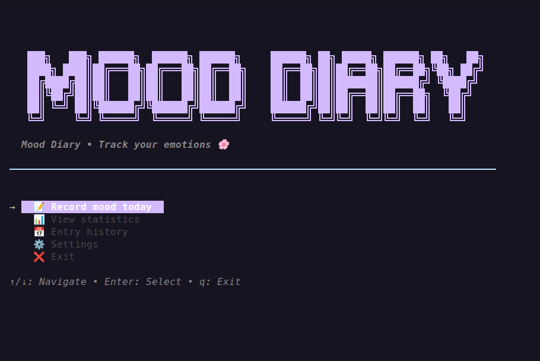
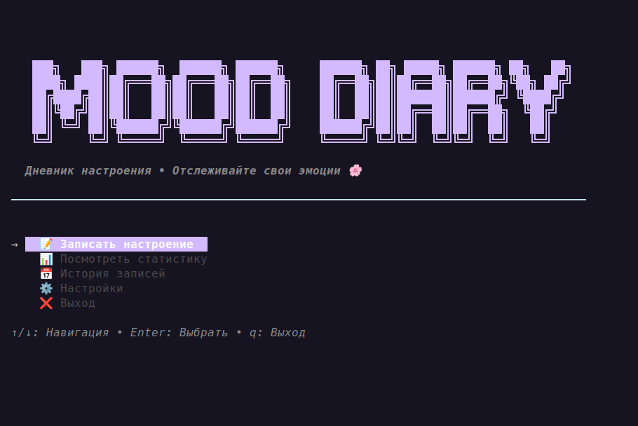

<p align="center">
  <strong>
    <a href="#-english">🇬🇧 English</a> • 
    <a href="#-russian">🇷🇺 Русский</a>
  </strong>
</p>

---

<a id="-english"></a>
# Mood Diary TUI


Beautiful terminal mood tracker with interactive TUI interface. Track your emotions, analyze trends, and take care of your mental health.




## ✨ Features

- **Mood Tracking** — Rate your day from 0 to 10 with emoji feedback
- **Interactive Statistics** — Visual charts, trends, and mood distribution
- **History View** — Browse all previous entries in a clean table
- **Pastel UI** — Soft, eye-friendly color scheme with Lipgloss
- **Keyboard + Mouse Support** — Navigate with arrows, hjkl, or click
- **Local-First** — All data stored locally in SQLite (no cloud required)
- **Clean Architecture** — DDD principles, testable, maintainable code

## 🛠️ Tech Stack

| Component | Technology |
|-----------|-----------|
| **Language** | Go 1.21+ |
| **TUI Framework** | [Bubble Tea](https://github.com/charmbracelet/bubbletea) — The Elm Architecture for terminal |
| **Styling** | [Lipgloss](https://github.com/charmbracelet/lipgloss) — Styles and colors |
| **Components** | [Bubbles](https://github.com/charmbracelet/bubbles) — Ready-made UI components |
| **Database** | SQLite with go-sqlite3 driver |
| **UUID** | Google UUID |

## 🚀 Installation
```bash
curl -fsSL https://raw.githubusercontent.com/ignavan39/mood_diary_tui/master/install.sh | sh
```

### Prerequisites

- Go 1.21 or higher
- GCC (for SQLite C bindings compilation)
- Linux/macOS (or WSL on Windows)

### Clone Repository

```bash
git clone https://github.com/ignavan39/mood_diary_tui.git
cd mood_diary_tui
```

### Install Dependencies

```bash
go mod download
```

### Build Application

```bash
go build -o mood-diary ./cmd/mood-diary
```

### Run

```bash
./mood-diary
```

Or run directly with Go:

```bash
go run ./cmd/mood-diary
```

### Install to PATH (Optional)

```bash
make install
# Adds binary to ~/.local/bin/mood-diary
# Make sure ~/.local/bin is in your $PATH
```

## 🎮 Usage

### Main Menu

On launch, you'll see the main menu with options:

```
→ 📝 Record mood today
  📊 View statistics
  📅 History
  ❌ Exit
```

**Controls:**
- `↑/↓` or `j/k` — Navigate menu
- `Enter` — Select option
- `q` or `Ctrl+C` — Quit

### Recording a Mood

1. Select "Record mood" from main menu
2. Use `←/→` to choose mood level (0–10)
3. Press `Enter` to add an optional note
4. Confirm with `y` or `Enter`

**Mood Scale:**
```
😢 😞 😔 😕 😐 😶 🙂 😊 😄 😁 🤩
0  1  2  3  4  5  6  7  8  9  10
```

### Viewing Statistics

Statistics display:
- **Total entries** for selected period
- **Average mood** level
- **Trend** — improving, worsening, or stable
- **Distribution** — histogram by mood levels
- **Dynamics** — sparkline chart of mood changes

**Periods:**
- Week (7 days)
- Month (30 days)
- Quarter (90 days)
- Year (365 days)
- All time

**Controls:**
- `←/→` — Switch periods
- `r` — Refresh data
- `Esc` — Return to menu

### History View

Browse all previous entries in table format:

```
Date       Mood   Note
──────────────────────────────────────────
01.04.2026 😊 8/10 Great day!
31.03.2026 😐 5/10 Regular day
30.03.2026 😄 9/10 Finished project
```

**Controls:**
- `↑/↓` or `j/k` — Navigate entries
- `Enter` — Edit entry (WIP)
- `r` — Refresh list
- `Esc` — Return to menu

## 🏗️ Architecture

Project follows **Domain-Driven Design (DDD)** and **Clean Architecture** principles:

```
mood_diary_tui/
├── cmd/
│   └── mood-diary/     # Application entry point
│       └── main.go
├── internal/
│   ├── domain/         # Business logic (core)
│   │   ├── entity/     # Entities
│   │   ├── repository/ # Repository interfaces
│   │   └── service/    # Domain services
│   ├── application/    # Application layer
│   │   └── usecase/    # Use Cases (business scenarios)
│   ├── infrastructure/ # Infrastructure layer
│   │   ├── persistence/# Repository implementations
│   │   └── database/   # DB configuration
│   └── presentation/   # Presentation layer
│       ├── tui/        # TUI components
│       └── styles/     # Styles and colors
├── go.mod
├── go.sum
└── README.md
```

### Architecture Layers

#### 1. Domain Layer
- **Entity**: `MoodEntry` — main entity with validation
- **Value Objects**: `MoodLevel` — mood level (0-10)
- **Repository Interfaces**: Abstractions for data access

#### 2. Application Layer
- **Use Cases**: `MoodService` — business scenarios (record, update, statistics)

#### 3. Infrastructure Layer
- **Database**: SQLite configuration with migrations
- **Repository**: `SQLiteMoodRepository` — repository implementation

#### 4. Presentation Layer
- **TUI**: Interactive screens built with Bubble Tea
- **Styles**: Pastel color scheme

## 🗄️ Database

### Schema

```sql
CREATE TABLE mood_entries (
    id TEXT PRIMARY KEY,
    date DATE NOT NULL UNIQUE,
    level INTEGER NOT NULL CHECK(level >= 0 AND level <= 10),
    note TEXT,
    created_at TIMESTAMP NOT NULL DEFAULT CURRENT_TIMESTAMP,
    updated_at TIMESTAMP NOT NULL DEFAULT CURRENT_TIMESTAMP
);

-- Indexes for fast queries
CREATE INDEX idx_mood_entries_date ON mood_entries(date DESC);
CREATE INDEX idx_mood_entries_date_range ON mood_entries(date);
```

### Location

Database is created automatically at:
```
~/.mood-diary/mood_diary.db
```

### Features

- **WAL Mode** — Write-Ahead Logging for better performance
- **Unique constraint** on date — only one entry per day
- **Automatic triggers** for `updated_at` updates
- **Soft delete** support (WIP)

## 🎨 Color Scheme

Application uses a pastel color palette for comfortable viewing:

```go
// Main colors
PastelPink    #FFB3BA
PastelPeach   #FFDFBA
PastelYellow  #FFFFBA
PastelMint    #BAFFC9
PastelSky     #BAE1FF
PastelLavender #D4BAFF
PastelRose    #FFBAE8
```

### Mood Gradient

Colors transition from **pastel red** (sad) to **pastel blue** (happy):

```
😢 → 😞 → 😔 → 😕 → 😐 → 😶 → 🙂 → 😊 → 😄 → 😁 → 🤩
🔴 → 🟠 → 🟡 → ⚪ → 🔵 → 💙
```

## 🔧 Development

### Adding New Features

1. **Domain Layer**: Add new entities or value objects
2. **Repository**: Extend repository interface
3. **Use Case**: Create new use case in application layer
4. **TUI**: Add new screen or component

### Example: Adding Tags to Entries

```go
// 1. Domain Entity
type Tag struct {
    ID   uuid.UUID
    Name string
}

// 2. Repository
type TagRepository interface {
    Create(ctx context.Context, tag *Tag) error
    FindByMoodID(ctx context.Context, moodID uuid.UUID) ([]*Tag, error)
}

// 3. Use Case
func (s *MoodService) AddTag(ctx context.Context, moodID uuid.UUID, tag string) error {
    // Implementation
}

// 4. TUI Screen
type TagsScreen struct {
    // Implementation
}
```

## 📊 Statistics & Metrics

Application calculates:

- **Average mood** level for period
- **Trend** — linear regression over recent entries
- **Distribution** — count of entries per mood level
- **Dynamics** — sparkline chart of changes

### Trend Formula

```
Trend = AverageSecondHalf - AverageFirstHalf

> 0.5  : Improving ↑
< -0.5 : Worsening ↓
else   : Stable ─
```

## 🤝 Contributing

Contributions are welcome!

### How to Contribute

1. Fork the repository
2. Create feature branch (`git checkout -b feature/amazing-feature`)
3. Commit changes (`git commit -m 'Add amazing feature'`)
4. Push to branch (`git push origin feature/amazing-feature`)
5. Open a Pull Request

### Code Style

- Follow Go standards (`gofmt`, `golint`)
- Document public functions
- Adhere to Clean Architecture principles

## 📝 TODO

- [ ] Data export (CSV, JSON)
- [ ] Data import
- [ ] Tags and categories
- [ ] Search notes
- [ ] Advanced visualization (calendar heatmap)
- [ ] Reminder notifications
- [ ] Backup/Restore functionality
- [ ] Additional themes
- [ ] Internationalization (more languages)

## 📄 License

MIT License — see [LICENSE](LICENSE) for details.

## 👨‍💻 Author

**Ivan Ignatenko**
- GitHub: [@ignavan39](https://github.com/ignavan39)

> 💙 *Take care of your mental health, one day at a time.*

---

<a id="-russian"></a>
# Дневник Настроения TUI


Красивый терминальный дневник настроения с интерактивным интерфейсом. Отслеживайте свои эмоции, анализируйте тренды и заботьтесь о своём ментальном здоровье.



## ✨ Возможности

- **Запись настроения** — Отмечайте своё настроение по шкале от 0 до 10 с эмодзи
- **Интерактивная статистика** — Визуализация данных с графиками и трендами
- **История записей** — Просмотр всех предыдущих записей в табличном формате
- **Пастельный интерфейс** — Приятный глазу интерфейс в мягких тонах через Lipgloss
- **Удобная навигация** — Управление клавиатурой и мышью
- **Локальное хранение** — Все данные хранятся локально в SQLite, без облака
- **Чистая архитектура** — Принципы DDD, тестируемость, поддержка кода

## 🛠️ Технологии

| Компонент | Технология |
|-----------|-----------|
| **Язык** | Go 1.21+ |
| **TUI Framework** | [Bubble Tea](https://github.com/charmbracelet/bubbletea) — The Elm Architecture для терминала |
| **Стилизация** | [Lipgloss](https://github.com/charmbracelet/lipgloss) — Стили и цвета |
| **Компоненты** | [Bubbles](https://github.com/charmbracelet/bubbles) — Готовые UI компоненты |
| **База данных** | SQLite с драйвером go-sqlite3 |
| **UUID** | Google UUID |

## 🚀 Установка
```bash
curl -fsSL https://raw.githubusercontent.com/ignavan39/mood_diary_tui/master/install.sh | sh
```
### Предварительные требования

- Go 1.21 или выше
- GCC (для компиляции C-привязок SQLite)
- Linux/macOS (или WSL на Windows)

### Клонирование репозитория

```bash
git clone https://github.com/ignavan39/mood_diary_tui.git
cd mood_diary_tui
```

### Установка зависимостей

```bash
go mod download
```

### Сборка приложения

```bash
go build -o mood-diary ./cmd/mood-diary
```

### Запуск

```bash
./mood-diary
```

Или напрямую через Go:

```bash
go run ./cmd/mood-diary
```

### Установка в PATH (опционально)

```bash
make install
# Бинарник добавится в ~/.local/bin/mood-diary
# Убедитесь, что ~/.local/bin есть в $PATH
```

## 🎮 Использование

### Главное меню

При запуске вы увидите главное меню с опциями:

```
→ 📝 Записать настроение
  📊 Посмотреть статистику
  📅 История записей
  ❌ Выход
```

**Управление:**
- `↑/↓` или `j/k` — навигация
- `Enter` — выбор
- `q` или `Ctrl+C` — выход

### Запись настроения

1. Выберите "Записать настроение" в главном меню
2. Используйте `←/→` для выбора уровня настроения (0–10)
3. Нажмите `Enter` для перехода к заметке
4. Введите заметку (необязательно) и нажмите `Enter`
5. Подтвердите запись нажатием `y` или `Enter`

**Шкала настроений:**
```
😢 😞 😔 😕 😐 😶 🙂 😊 😄 😁 🤩
0  1  2  3  4  5  6  7  8  9  10
```

### Просмотр статистики

Статистика показывает:
- **Всего записей** за выбранный период
- **Средний уровень** настроения
- **Тренд** — улучшается, ухудшается или стабильно
- **Распределение** — гистограмма по уровням настроения
- **Динамика** — график изменения настроения за период

**Периоды:**
- Неделя (7 дней)
- Месяц (30 дней)
- Квартал (90 дней)
- Год (365 дней)
- Всё время

**Управление:**
- `←/→` — переключение периодов
- `r` — обновить данные
- `Esc` — вернуться в меню

### История записей

Просмотр всех предыдущих записей в табличном формате:

```
Дата       Настроение  Заметка
──────────────────────────────────────────
01.04.2026 😊 8/10     Отличный день!
31.03.2026 😐 5/10     Обычный день
30.03.2026 😄 9/10     Закончил проект
```

**Управление:**
- `↑/↓` или `j/k` — навигация по записям
- `Enter` — редактировать запись (в разработке)
- `r` — обновить список
- `Esc` — вернуться в меню

## 🏗️ Архитектура

Проект следует принципам **Domain-Driven Design (DDD)** и **Clean Architecture**:

```
mood_diary_tui/
├── cmd/
│   └── mood-diary/     # Точка входа приложения
│       └── main.go
├── internal/
│   ├── domain/         # Бизнес-логика (ядро)
│   │   ├── entity/     # Сущности
│   │   ├── repository/ # Интерфейсы репозиториев
│   │   └── service/    # Доменные сервисы
│   ├── application/    # Прикладной слой
│   │   └── usecase/    # Use Cases (бизнес-сценарии)
│   ├── infrastructure/ # Инфраструктурный слой
│   │   ├── persistence/# Реализации репозиториев
│   │   └── database/   # Конфигурация БД
│   └── presentation/   # Слой представления
│       ├── tui/        # TUI компоненты
│       └── styles/     # Стили и цвета
├── go.mod
├── go.sum
└── README.md
```

### Слои архитектуры

#### 1. Domain Layer (Доменный слой)
- **Entity**: `MoodEntry` — основная сущность с валидацией
- **Value Objects**: `MoodLevel` — уровень настроения (0-10)
- **Repository Interfaces**: Абстракции для работы с данными

#### 2. Application Layer (Прикладной слой)
- **Use Cases**: `MoodService` — бизнес-сценарии (запись, обновление, статистика)

#### 3. Infrastructure Layer (Инфраструктурный слой)
- **Database**: Конфигурация SQLite с миграциями
- **Repository**: `SQLiteMoodRepository` — реализация репозитория

#### 4. Presentation Layer (Слой представления)
- **TUI**: Интерактивные экраны на Bubble Tea
- **Styles**: Пастельная цветовая схема

## 🗄️ База данных

### Схема

```sql
CREATE TABLE mood_entries (
    id TEXT PRIMARY KEY,
    date DATE NOT NULL UNIQUE,
    level INTEGER NOT NULL CHECK(level >= 0 AND level <= 10),
    note TEXT,
    created_at TIMESTAMP NOT NULL DEFAULT CURRENT_TIMESTAMP,
    updated_at TIMESTAMP NOT NULL DEFAULT CURRENT_TIMESTAMP
);

-- Индексы для быстрого поиска
CREATE INDEX idx_mood_entries_date ON mood_entries(date DESC);
CREATE INDEX idx_mood_entries_date_range ON mood_entries(date);
```

### Расположение

База данных создаётся автоматически в:
```
~/.mood-diary/mood_diary.db
```

### Особенности

- **WAL Mode** — Write-Ahead Logging для лучшей производительности
- **Unique constraint** на дату — только одна запись в день
- **Автоматические триггеры** для обновления `updated_at`
- **Soft delete** поддержка (в разработке)

## 🎨 Цветовая схема

Приложение использует следующую цветовую палитру для комфортного просмотра:

```go
// Основные цвета
PastelPink    #FFB3BA
PastelPeach   #FFDFBA
PastelYellow  #FFFFBA
PastelMint    #BAFFC9
PastelSky     #BAE1FF
PastelLavender #D4BAFF
PastelRose    #FFBAE8
```

### Градиент настроений

Цвета меняются от **пастельно-красного** (грустно) до **пастельно-голубого** (счастливо):

```
😢 → 😞 → 😔 → 😕 → 😐 → 😶 → 🙂 → 😊 → 😄 → 😁 → 🤩
🔴 → 🟠 → 🟡 → ⚪ → 🔵 → 💙
```

## 🔧 Разработка

### Добавление новых функций

1. **Доменный слой**: Добавьте новые entity или value objects
2. **Репозиторий**: Расширьте интерфейс репозитория
3. **Use Case**: Создайте новый use case в application layer
4. **TUI**: Добавьте новый экран или компонент

### Пример: Добавление тегов к записям

```go
// 1. Domain Entity
type Tag struct {
    ID   uuid.UUID
    Name string
}

// 2. Repository
type TagRepository interface {
    Create(ctx context.Context, tag *Tag) error
    FindByMoodID(ctx context.Context, moodID uuid.UUID) ([]*Tag, error)
}

// 3. Use Case
func (s *MoodService) AddTag(ctx context.Context, moodID uuid.UUID, tag string) error {
    // Implementation
}

// 4. TUI Screen
type TagsScreen struct {
    // Implementation
}
```

## 📊 Статистика и метрики

Приложение вычисляет:

- **Средний уровень** настроения за период
- **Тренд** — линейная регрессия за последние записи
- **Распределение** — количество записей по каждому уровню
- **Динамика** — sparkline график изменений

### Формула тренда

```
Тренд = СреднееВторойПоловины - СреднееПервойПоловины

> 0.5  : Улучшается ↑
< -0.5 : Ухудшается ↓
else   : Стабильно ─
```

## 🤝 Участие в разработке

Приветствуются contributions!

### Как внести вклад

1. Fork репозиторий
2. Создайте feature branch (`git checkout -b feature/amazing-feature`)
3. Commit изменения (`git commit -m 'Add amazing feature'`)
4. Push в branch (`git push origin feature/amazing-feature`)
5. Откройте Pull Request

### Code Style

- Следуйте стандартам Go (`gofmt`, `golint`)
- Документируйте публичные функции
- Придерживайтесь принципов Clean Architecture

## 📝 TODO

- [ ] Экспорт данных (CSV, JSON)
- [ ] Импорт данных
- [ ] Теги и категории
- [ ] Поиск по заметкам
- [ ] Более сложная визуализация (календарь-тепловая карта)
- [ ] Напоминания о записи
- [ ] Backup/Restore функциональность
- [ ] Дополнительные темы оформления
- [ ] Интернационализация (больше языков)

## 📄 Лицензия

MIT License — подробности в файле [LICENSE](LICENSE).

## 👨‍💻 Автор

**Иван Игнатенко**
- GitHub: [@ignavan39](https://github.com/ignavan39)

> 💙 *Заботьтесь о своём ментальном здоровье — один день за раз.*

---
```


